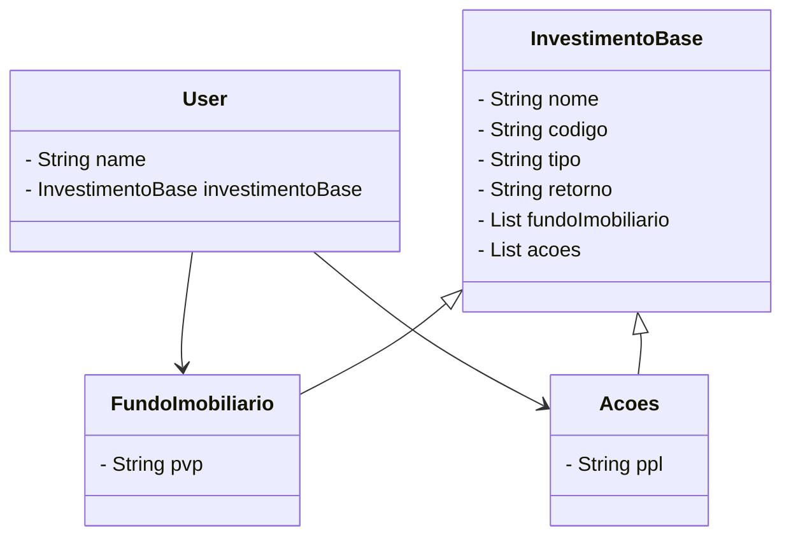

#Santander Dev Week 2023
Java Restful criada como projeto final da Dev Week Santander

## Diagrama de classes

```mermaid
classDiagram
  class User {
    - String name
    - InvestimentoBase investimentoBase
  }

  class InvestimentoBase {
    - String nome
    - String codigo
    - String tipo
    - String retorno
    - List<FundoImobiliario> fundoImobiliario
    - List<Acoes> acoes
  }

  class FundoImobiliario {
    - String pvp
  }

  class Acoes {
    - String ppl
  }

  User --> FundoImobiliario
  User --> Acoes
  InvestimentoBase <|-- FundoImobiliario
  InvestimentoBase <|-- Acoes
```
